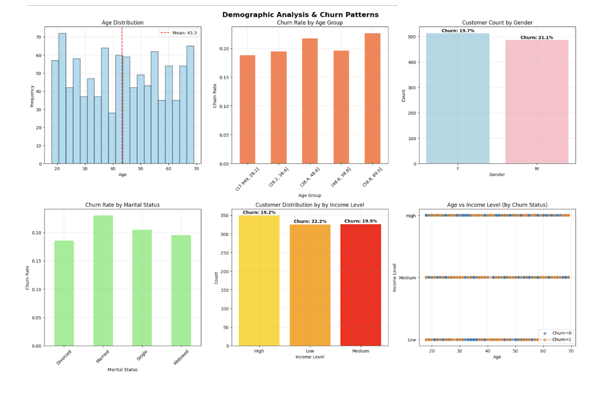
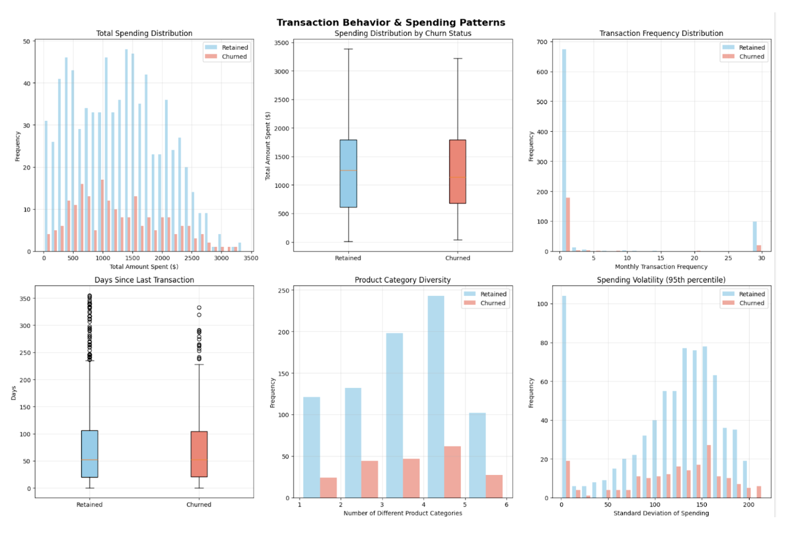

# Lloyds Banking Group Customer Churn Prediction

## Introduction 
This project was completed as part of the Lloyds Banking Group Data Science Virtual Experience Program on Forage. The objective was to develop a machine learning solution to predict customer churn, enabling the bank to proactively identify at-risk customers and implement targeted retention strategies.

### Business Context 
Customer churn represents a significant challenge for financial institutions, with acquiring new customers costing 5-7 times more than retaining existing ones. This project addresses Lloyds' need to understand and predict customer attrition patterns to optimize retention efforts and reduce revenue loss.

### Project Objectives
- Analyze customer behavior patterns across transactional, demographic, and engagement data
- Identify key drivers of customer churn through exploratory data analysis
- Build and evaluate machine learning models for churn prediction
- Deliver actionable insights and risk segmentation for business stakeholders

  ## Quick Results & Impact

| Metric | Result | Business Impact |
|--------|--------|-----------------|
| **Churn Detection Rate** | 58.5% | Successfully identifies over half of at-risk customers |
| **Model F1-Score** | 0.343 | Balanced precision-recall performance for imbalanced data |
| **ROC-AUC Score** | 0.601 | Significantly outperforms random chance (50%) |
| **High-Risk Customers Identified** | ~99 per 200 | Enables targeted retention campaigns |

### Key Findings
- Digital Engagement is King: Login frequency emerged as the strongest churn predictor (18.1% feature importance)
- Service Quality Critical: Customers with a single unresolved support interaction show 24% churn rate
- Surprising Insight: Higher-spending customers actually show increased churn risk, challenging conventional assumptions
- Age Factor: Customers aged 58.8-69 years exhibit 22.6% churn rate vs 20.4% overall average

# Lloyds Customer Churn Analysis: Data Gathering, EDA & Preprocessing Report

### Abstract 
This report presents a comprehensive analysis of customer churn data, encompassing data gathering, exploratory data analysis (EDA), and preprocessing for predictive modelling. The analysis reveals key insights into customer behaviour patterns and identifies critical factors influencing churn decisions. The final datasets contain 1,000 customers with a 20.4% churn rate, processed into 27 features ready for machine learning model development. 

### Dataset Selection
Five datasets were evaluated for their relevance to customer churn prediction, based on predictive power, data completeness, business actionability, feature richness and temporal relevance. 

The Transaction History dataset emerged as the highest priority with a score of 9.0/10 due to its high predictive power and behavioural insights. The datasets provide critical insights into customer spending patterns, purchase frequency, and product preferences, which research consistently shows as strong predictors of churn behaviour. 

Customer Demographics secured a high priority ranking with an 8.0/10 score due to its strong segmentation value and predictive capability. Age, gender, marital status and income levels provide essential demographic profiling essential for a comprehensive analysis of churn predictors. 

The Customer service database also achieved a 8.0/10 score, reflecting the direct correlation between service experience and churn decisions. Poor service quality and unresolved issues serve as immediate churn predictors, while resolution rates and interaction frequency revealed customer satisfaction levels. 

Online Activity received a 7.8/10 score, representing strong relevance as login frequency and digital engagement patterns strongly correlate with customer retention. The dataset provides valuable insights into customer engagement levels and platform preferences. 

The Churn datasets, while receiving an 8.0/10 score, serve as the essential target variables for machine learning models. This dataset provides the information necessary for training predictive algorithms and enables proper model validation and performance evaluation. 

## Exploratory Data Analysis (EDA) 
The integrated dataset encompasses 1,000 customers with a balanced churn distribution of 20.4% churned with 79.6% retained customers. The dataset achieved 100% completeness after preprocessing, with 27 engineered features. 

### Demographic Analysis
The demographic analysis revealed the mean age was 43.3 years and a standard deviation of 15.2 years, indicating a diverse customer base spanning 18 to 69 years. The age analysis identified customers aged 58.8 to 69 years as the highest risk group, exhibiting a 22.6% churn rate compared to the overall average of 20.4%. 

Gender differences in churn are minimal, with male customers showing a slightly higher churn rate of 21.2% compared to 18.7% for female customers. However, marital status analysis revealed more significant variation, with married customers exhibiting the highest churn rate at 22%, followed by single customers at 20.5%. Divorced and widowed customers showed lower churn rates of 18.5% and 19.6% respectively, suggesting that established life situations may contribute to customer stability. 

Income level analysis demonstrated that low-income customers face the highest churn risk at 22.2%, while high-income customers show the lowest risk at 19.2%. This shows economical factors play an important role in customer retention with financial constraints potentially driving churn among lower-income segments. 

### Transaction Behavior Analysis
The transaction behaviour analysis reveals patterns that challenge conventional assumptions about spending and churn relationships. Surprisingly churned customers actually spend slightly more per transaction on average (£255.83) compared to retained customers (£247.01), representing an £8.82 difference. However, churned customers have a significantly lower tranaction frequency, with churned customers averaging 3.66 transitions per month compared to 4.45 for retained customers. 

Total spending patterns show minimal differences between groups, with churned customers spending £1,269.01 versus £1,266.58 for retained customers. This near identical total spending, combined with higher average transactions but lower frequency, suggest that churned customers may represent a segment that engages less frequently but maintains higher-value interactions when they do engage. 

### Customer Service Analysis 
Service interaction patterns reveal critical insights into the relationship between customer support experience and churn behaviour. Among the 1,000 customers, 668 (66.8%) have service interactions history, with an average of 1.5 interactions per customer, with an average resolution rate of 52.8%. The analysis uncovered that customers with exactly one service interaction exhibit the highest churn rate at 24% compared to 18.4% for customer with no interaction and 18.9% for those with two interactions. 

This suggests customers who churn after a single unresolved support interaction highlights that first-contact resolution quality is a critical driver of retention. 

### Digital Engagement Analysis
Digital engagement analysis reveals significant differences in online behaviour between retained and churned customers. Retained customers demonstrate higher login frequency with an average of 26.5 logins per month compared to 23.6 for churned customers. This 2.9 login difference represents the engagement variation that correlates with retention outcomes. 

Platform preference analysis shows notable churn rate variation across different digital channels. Website users exhibit the lowest churn rate at 17.8%, while mobile app users show the highest at 23.1%. Online banking users fall in between at 20.1%. These differences suggest platform choice impacts customer engagement levels or satisfaction. 

### Feature Correlation Analysis 
The correlation analysis identified login frequency as the strongest predictor of churn behaviour with a correlation coefficient of -0.082, indicating that lower digital engagement affects churn decisions. The average tranaction amount showed a positive correlation of 0.045, suggesting that higher spending customers may actually represent higher churn risk. 

Transaction frequency demonstrated a negative correlation of -0.034 with churn, reinforcing the importance of consistent engagement over absolute spending levels. Age showed a mild positive correlation of 0.029, suggesting older customers are at higher churn risk. Resolution rate exhibited a small positive correlation of 0.009, which could reflect that customers requiring resolution service are inherently at higher risk regardless of outcome quality. 

### Anomaly Detection and Risk Segmentation
The anomaly detection process identifies several customer segments with elevated churn risk characteristics. High spending customers, representing 0.8% of the dataset with 8 outliers, exhibit a 37.5% churn rate compared to the 20.3% baseline for normal customers. This could mean that erratic spending patterns may signal customer distress or changing circumstances that cause churn. 

Customers with extended periods since their last transaction (66 outliers representing 6.6% of the dataset) showed a high churn rate at 24.2% versus 20.1% for normal engagement patterns. Interestingly, customers with extremely high transaction frequency (148 outlier, 14.8% of the dataset) actually demonstrated lower churn rates at 17.6%. 

The analysis identified three high risk customer segments requiring immediate attention. High spenders with recent inactivity, which represents 18 customers with a 16.7% churn rate, frequent service user lower resolution encompass 259 customers with 17.8% churn, and low digital customers which include 69 individuals with 18.8% churn rates. 

## Data Cleaning and Preprocessing 
### Missing Value Treatment
The missing value analysis revealed systematic patterns primarily in service related features. Service interaction showed 332 missing values (33.2%) of the dataset, representing customers who never contacted customer support.This extended to related features including service dates, resolution rates, and days since last service. The treatment strategy employed semantic filling, recognising that missing service data represent meaningful business information rather than data collection failures. 

Spending volatility showed 117 missing values (11.7%) of customers with insufficient transition history to the calculator volatility metric. These were filled with zero, indicating no spending volatility due to limited transaction patterns. 

### Outlier Handling Strategy
The outlier handing approach considers that extreme values often represent legitimate customer segmentation rather than data errors. Therefore, the majority of outliers were retained, acknowledging that high spender, frequent user, and highly engaged customers represent valid business scenarios within distinct churn patterns. 

Limited capping was applied only to transaction frequency, where 10 extreme outliers received adjustments. This selective approach preserved meaningful business variation while addressing only the most extreme statistical outlier that could distort model training. 

### Feature Engineering 
The feature engineering process transformed raw transnational data into behavioural indicators through systematic aggregation and calculation. Transaction features were engineered to capture spending patterns, frequency metric, and temporal relationships that research identified as churn predictors. 

New transaction features included total spending per customer, average transaction amounts, transaction counts, and spending volatility calculations. Temporal features captured days since last transaction, customer tenure calculations, and transaction frequency rates that revealed engagement patterns over time. Product category diversity metric quantifies customer breadth of engagement across different service offerings. 

Service features were engineered to quantify support interaction patterns, resolution effectiveness, and service recency, Digital engagement features focused on login frequency patterns, platform usage preferences, and digital activity that correlate with customer retention outcomes. 

### Feature Scaling and Normalisation 
The scaling strategy employed differentiated approaches based on features characteristics and distribution patterns. Large scale features including total spending, customer tenure, and days since last service receives StandardScaler treatment to achieve a mean-centered distribution with unit variance, enabling effective model training across varied scales. 

Moderate ranges features such as age, transaction counts, and login frequency received MinMaxScaler normalisation to preserve relative relationships while constraining values to the 0-1 range. This approach maintains interpretability while ensuring balanced feature influence in model training. 

Right skewed features inkling days since last transaction and transaction frequency underwent logarithmic transformations between StandardScaler applications, addressing situational issues that could bias model performance. 

### Categorical Encoding implementation
Gender received binary encoding due to its straight forward two category structure, creating a single encoded feature. While, marital status underwent a one-hot encoding to handle its four nominal categories without an order. This approach created four binary features representing divorced, married, single and widowed status, enabling models to capture category specific effects. 

Income level received ordinal encoding recognising the natural progression from low to medium to high categories. This will allow models to capture linear income effects on churn behaviour. Service usage platform preferences were one-hot encoded to represent the three normal platforms (mobile app, website, online banking) without ordering. This allows for detection of platform specific churn patterns while maintaining categorical independence. 

### Final Dataset Preparations 
The preprocessing pipeline successfully transformed the original 24 feature dataset into a model ready 27 feature dataset through systematic feature engineering and encoding expansion. The final feature composition includes one identifier feature (CustomerID), seven demographic features covering age and encoded categorical variable, eight transaction features capturing spending and engagement patterns, six service features quantifying support interactions, and five digital engagement features measuring online behaviour patterns. The single target variable (ChurnStatus) is essential for supervised learning applications. 

## Conclusion 
Overall the analysis revealed counterintuitive churn drivers, with digital engagement as the strongest retention predictor, single unresolved service interactions as critical churn risk, and high spending as a poor retention signal. The data preprocessing provides a clean, feature rich dataset that will enable predictive modelling. 

# Lloyds Customer Churn Prediction Model Report 

## Abstract
This report presents a machine learning for prediction Lloyd’s customer churn using a dataset of 1,000 customers with 25 behavioural and demographic features. The selected Decision Tree Algorithm with undersampling achieved an F1-score of 0.343 and ROC-AUC of 0.601, successfully identifying 58.5% of customers likely to churn. The model provides actionable insights and is ready for business deployment. 

## Algorithm Selection 

### Data Characteristic Review
The dataset exhibits significant class imbalance with 79.6% retained customers and 20.4% churned customers. This imbalance presents a fundamental challenge where traditional algorithms tend to predict the majority class, providing limited business value. The dataset contains 25 preprocessed features including customer behaviour metrics, transaction patterns, and engagement indicators with no missing values. 

### Algorithm Evaluation Process
Five machine learning algorithms were systematically evaluated across four different sampling strategies to address the class imbalance problem. Logistic regression, decision trees, random forest, gradient boosting machines, and neural networks were tested using original data with class weights, oversampling, undersampling, and combined resampling approaches.  

### Selected Algorithm: Decision tree with Undersampling 
The decision tree algorithm combined with undersampling was selected based on optimal performance and business suitability criteria. The combination achieved the highest F1-score of 0.343 after hyperparameter tuning, demonstrating the best balance between precision (24.2%) and recall (58.5%). The undersampling strategy proved most effective by creating a balanced training dataset of 326 samples with 50% churn rate. 

The decision was chosen over alternatives for three key reasons. First, it provides exceptional interpretability through clear decision paths and feature importance ranking that business stakeholders can easily understand and act upon. Secondly, it offers implementation simplicity for production deployment and maintenance. Third, the algorithm naturally handles mixed data types and non-linear relationships without requiring extensive feature preprocessing. 

## Model Training and Development 

### Training Process
The model was trained using the undersampled dataset where the majority class was randomly reduced to match the minority class size. This approach created a balanced training set of 326 customers with equal representation of churned and retained customers. The training process utilised stratified sampling to maintain consistent class distribution among training and validation sets. 

### Cross-Validation Implementation 
Five-fold stratified cross-validation was implemented to ensure robust model generalisation to unseen data. The stratified approach maintained the class balance across all folds, providing reliable performance estimates. Cross-Validation results demonstrated consistent performance across folds with minimal variance, indicating stable model behaviour. 

### Hyperparameter Tuning 
Grid search optimization was performed to identify optimal hyperparameters using F1-score as the primary metric, appropriate for imbalanced classification problems. The optimization process evaluated a combination of max_depth (3, 5, 10, 15, None), min_samples_split (2, 5, 10, 20), and min_samples_leaf(1, 2, 5, 20). The best performing configuration used max_depth = 10, min_samples_leaf =10, and min_samples_split = 2, achieving a cross validation F1-score of 0.564. 

## Model Performance Evaluation

### Performance Metric Analysis 
The final model demonstrates solid performance across multiple evaluation metrics appropriate for imbalanced datasets. Accuracy reached 54% representing overall prediction correctness. Precision of 24.2% indicates that approximately one in four customers predicted to churn actually do churn, while recall of 58.5% shows the model successfully identifies more than half of actual churners. The F1-score of 34.3% provides a balanced measure of precision and recall performance.  

### ROC-AUC 
The ROC-AUC score of 60.1% demonstrates moderate discriminative ability, significantly outperforming random chance (50%). This indicates the model can meaningfully distinguish between customers who will churn, and those who will remain, providing valuable business intelligence for retention efforts.  

### Confusion Matrix Insights
The confusion matrix on the validation set reveals critical business implications with 84 true negatives (correctly identifies loyal customers), 24 true positives (successfully flagged churners), 75 false positives (loyal customer incorrectly flagged), and 17 false negatives (missed churns). The model successfully identifies 24 out of 41 actual churns, representing a 58.5% churn prevention opportunity. 

### Imbalanced Database Considerations 
The evaluation metric accounts for the inherent challenges of imbalanced datasets where traditional accuracy can be misleading. The focus on F1-score, precision, and recall provides a comprehensive view of model effectiveness specifically for minority class prediction.

### Feature Importance and Business Insights 
The model identified ten critical features driving churn prediction. LoginFrequency emerged as the most important predictor (18.1%), indicating declining login activity strongly signals churn risk. Days_Since_Last_Login ranked second (14.9%), showing extended platform absence as a key indicator. Customer_Tenure_Days contributed 10.8% importance, revealing higher churn risk among newer customers.
Transaction-related features including Avg_Transaction (8.9%) and Days_Since_Last_Transaction_log (7.5%) demonstrate the importance of recent financial activity. Demographic factors like Age (7.8%) and behavioral patterns including Spending_Volatility (6.4%) provide additional predictive power. These insights reveal that engagement metrics dominate churn prediction, with the top two features accounting for 33% of total model importance.

## Business Application 

### Use for Business Strategy 
The model enables identification of at risk customers through churn probability scoring. Customers with churn probability above 0.5 should receive immediate retention attention through targeted campaigns. The model identifies around 99 high-risk customers per 200 evaluated, showing a large opportunity. 

### Customer Segmentation 
Implementation should utilize their risk segmentation such as high risk customers (top 20% of scores) requiring immediate and personalised attention. Medium risk customers (next 30%) should receive automated campaigns and incentives. Low risk customers can be maintained through standard campaigns whilst being monitored. 

## Model Improvement Recommendations 

### Immediate Enhancement
Different customer segments may warrant distinct threshold strategies, requiring A/B testing of various approaches to maximize business impact while minimizing false positive costs.

Feature engineering should leverage model insights to create more sophisticated predictive variables. Engagement trend features covering multiple time windows would provide richer behavioral context. Behavioral change detection could identify sudden activity drops signaling immediate churn risk. Customer journey features should capture onboarding success and product adoption patterns.

### Advanced Modeling Approaches
Ensemble methods combining multiple algorithms could improve performance while balancing performance improvements with interpretability. Advanced algorithms including XGBoost or LightGBM should be evaluated against the current decision tree to determine if complexity increases justify performance gains.

Model segmentation should develop separate models for distinct customer types, recognizing that churn drivers may vary across demographics or usage patterns. 

### Infrastructure and Monitoring
Real time prediction capability should be developed to enable immediate response to churn signals through automated systems integration. Performance monitoring dashboards should track model accuracy, business impact, and feature drift to ensure sustained effectiveness.  Monthly retraining procedures should be established to adapt to evolving customer behaviors and market conditions.

### Conclusion 
The developed decision tree model with undersampling demonstrates the ability to identify over half of customers at risk of churn, offering actionable insights for Lloyds’ retention strategy. While performance metrics such as an F1-score of 0.343 and ROC-AUC of 0.601 indicate room for improvement, the model provides clear interpretability and immediate business value through risk segmentation and targeted interventions. Engagement-related features, particularly login frequency and recency of activity, emerged as the strongest churn predictors, underscoring the importance of monitoring customer interaction patterns. With further enhancement through feature engineering, ensemble methods, and real-time monitoring, this model establishes a strong foundation for proactive churn management and long-term customer retention initiatives.

